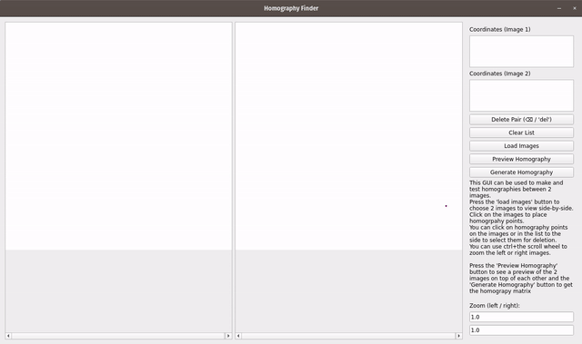
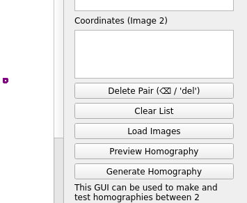
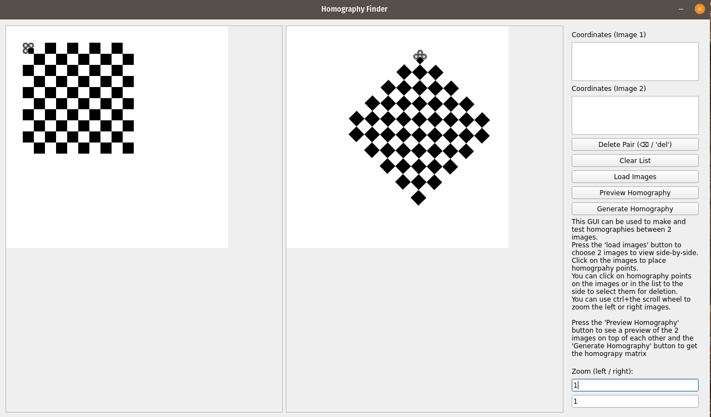
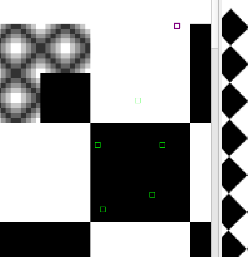
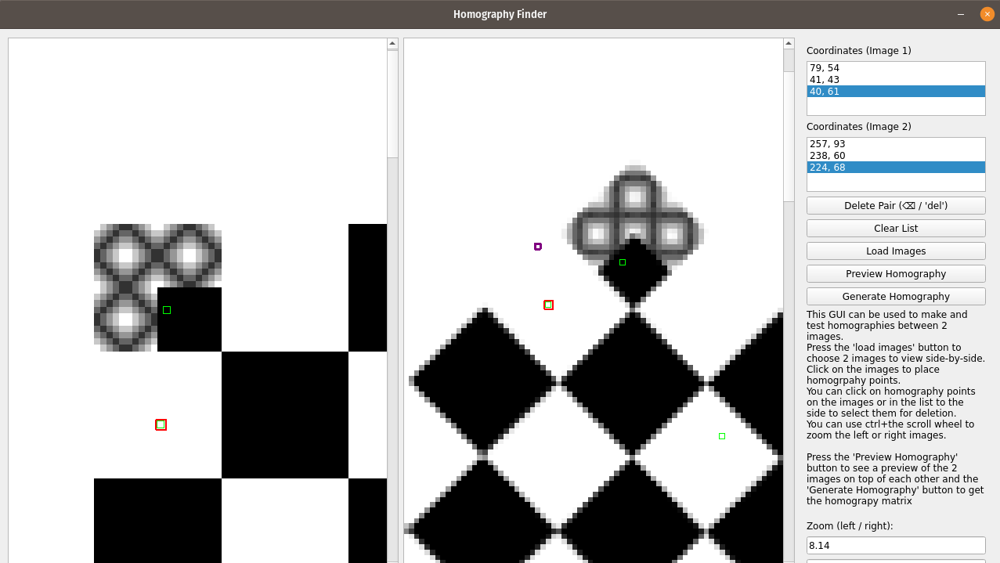

# manual-homography-gui

This gui allows you to specify a homography between 2 images (or sets of images) by manually clicking on key-points and then preview the homography.




### Requirements

This gui requires `numpy` (`pip3 install numpy`), `pyqt5` (`pip3 install pyt5`), and `cv2` (`pip3 install opencv-python`).

I've had some issues having both `pyqt5` and `opencv-python` installed on the same computer. I would get the following error:

```
pyqt5 qt.qpa.plugin: Could not load the Qt platform plugin "xcb" even though it was found.
```

The easiest workaround I've found is to install `opencv-python-headless` instead of `opencv-python`.

### Specifying a homography

To use this gui, you first have to choose 2 images with the 'Load Images' button. If at any time you want to use another set of 2 images to continue mapping the same homography, just press the 'Load Images' button again. Your selected points will be retained!



Once your images have been loaded, you can click on the left and right images to specify homography points. The first click on the left image will correspond to the first click on the right image and so-on. The suggested workflow is to click once on the left image and once on the right image.



You can zoom into images by doing **ctrl+scroll** over the left or right image or by entering a zoom amount manually in the bottom right text boxes and pressing enter.



If you accidentally create a homography point you don't want, you can select the point by clicking on it in the image or by selecting the point in the "coordinate list" on the top-left. The selected points will be highlighted with red.



Be careful - coordinates are always selected in pairs. If you delete coordinate N from the left image, it will also be deleted from the right image (unless there's an uneven number of coordinates in the 2 images).

### Previewing and generating a homography.

Once you think you have a homography you'll be happy with, press the "Preview Homography" button. This will open a new window overlaying the left image on the right image. The images will be drawn on top of one another with a transparency. You can adjust the amount of transparency with the alpha slider at the bottom of the dialog to see if you're happy with the homography or not.

If the homography needs more work, you can go back and add or remove points in the main gui.

When you're ready to get the final homography matrix, press the "Generate Homography" button!
